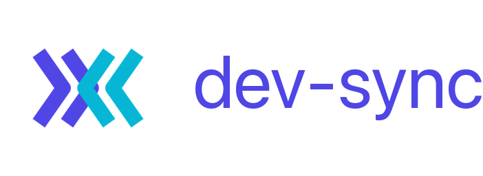
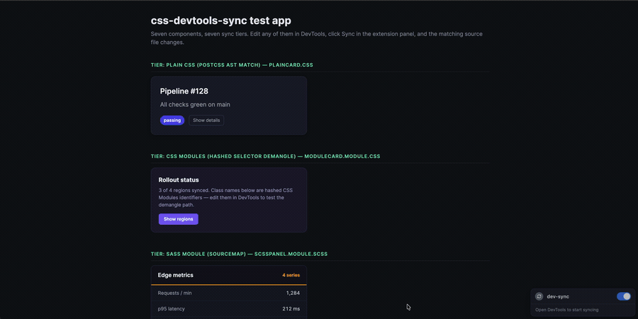

<div align="center">



<h1>dev-sync</h1>

**Edit CSS in Chrome DevTools → it writes back to your source files.**

Plain CSS · Sass modules · Emotion/styled css-in-js · Tailwind class lists — synced from the Styles panel to disk through a local apply engine and a DevTools extension.



<!-- badges -->
[](https://github.com/bthe0/css-devtools-sync/actions/workflows/ci.yml)
[](https://github.com/bthe0/css-devtools-sync/actions/workflows/codeql.yml)
[](package.json)
[](https://pnpm.io)
[](tsconfig.base.json)
[](https://vite.dev)
[](LICENSE)
[](https://buymeacoffee.com/bthe0)

</div>

---

> **🤖 Setting this up with an AI agent?** Point it at **[`README_LLM.md`](./README_LLM.md)** — a step-by-step setup runbook written for LLMs (verify toolchain → install/build/test → pick the write-jail root → load the extension). It stops to ask you where to run and before touching your browser.

## Requirements

- **Node ≥ 20** and **pnpm 10** (pinned via `packageManager`).
- A **Vite** app (Vue, Svelte, Qwik, or React + Vite). Build-owning frameworks (Next.js, Nuxt, Astro, SvelteKit) aren't supported yet.
- **Chrome** (the DevTools extension is Chromium MV3).

**AI-assisted rule placement is optional.** All five apply tiers are fully deterministic and run with no API key. Setting `ANTHROPIC_API_KEY` only lets Claude break ties when a *brand-new* rule could plausibly land in several source files; without it, dev-sync falls back to a deterministic pick. LLM placement is disabled entirely when `APP_ENV=production`. **Claude is not required to run dev-sync.**

## What it does

You tweak `border-radius` on a rule in the DevTools **Styles** panel. `dev-sync` figures out which source construct produced that rule — a `.css` file, a compiled `.module.scss`, an Emotion template literal, or a Tailwind utility in a `className` — and writes the edit **back into that source**. Vite HMR reloads, and the change now comes from your code, not a runtime override.

It resolves DevTools → source through two channels:

- **CSS → source**: CSS sourcemaps (enabled automatically by the `devSync()` bundler plugin) plus per-tier apply strategies (`postcss`, `sourcemap`, `cssinjs`, `classlist`).
- **DOM element → source**: a Babel plugin stamps every JSX host element at dev time with a **non-enumerable `__srcLoc` JS property** (`{ dataSourceFile, dataSourceLine, dataSourceComponent }`) — read off `$0.__srcLoc` over CDP. It is *not* a `data-source-*` DOM attribute (those would pollute the Elements panel).

## The test app

The fixture app exercises every styling tier in one page — each block maps to a distinct apply strategy (plain CSS, CSS Modules, Sass sourcemap, css-in-js, Tailwind class lists, static markup, image attrs). The demo above runs against it.

## Quick start (drop-in)

One plugin self-configures the CSS sourcemap, boots the apply engine on your dev server's own origin, and stamps JSX:

```ts
// vite.config.ts
import { defineConfig } from "vite";
import react from "@vitejs/plugin-react";
import { devSync } from "@dev-sync/vite";

export default defineConfig({
  plugins: [react(), devSync()],
});
```

Or let the CLI detect your stack and edit the config for you (previews a diff, writes only on confirm):

```sh
pnpm dlx @dev-sync/server init
```

Then **Load unpacked** `apps/extension/` at `chrome://extensions` (Developer mode on), open your app's DevTools, and use the **Source Sync** panel.

## Monorepo layout

```
packages/
  contract/                      @dev-sync/contract — wire protocol (Zod v4 schemas + TS types)
  babel-plugin-source-locator/   @dev-sync/babel-plugin-source-locator — stamps JSX host elements
                                 with the off-DOM __srcLoc property (dev only) + Vite wrapper
  vite/                          @dev-sync/vite — drop-in devSync() plugin: CSS devSourcemap +
                                 apply engine on the dev-server origin + source-locator
apps/
  server/                        @dev-sync/server — apply engine + `dev-sync init` CLI; writes are
                                 jailed to DEV_SYNC_WORKSPACE_ROOT (fail-closed)
  test-app/                      @dev-sync/test-app — fixture app exercising every styling tier
  extension/                     Chrome MV3 DevTools extension (plain JS, loaded unpacked)
```

`@dev-sync/contract` is the single source of truth for the extension ⇄ server protocol.

## Framework support

The `devSync()` plugin works on any Vite app. Frameworks split two ways:

| Bucket | Frameworks | `init` behavior |
|---|---|---|
| **Vite-plugin** (editable `plugins` array) | Vue, Svelte, Qwik, plain React+Vite | onboarded — `devSync()` added to your config |
| **Build-owning** (own their config/build) | Next.js, Nuxt, Astro, SvelteKit, Remix, SolidStart | detected & skipped with a note (they need their own integration) |

> **Next.js note:** Next runs its own dev server and defaults to Turbopack, so a webpack-plugin transport does not attach — Next support is tracked separately.

## What edits map where (per tier)

| Component (test-app) | Styling tier | Edit in DevTools | Source that changes | Apply mode |
|---|---|---|---|---|
| `PlainCard` | Plain CSS file | `.plain-card*` rules | `PlainCard.css` | `postcss` |
| `ScssPanel` | Sass module (sourcemapped) | `.panel*` (hashed classes) | `ScssPanel.module.scss` | `sourcemap` |
| `EmotionButton` | Emotion `styled` | `css-*--EmotionButton*` classes | template literal in `EmotionButton.tsx` | `cssinjs` |
| `TailwindHero` | Tailwind utilities | a utility class (e.g. `.p-8`) | `className` in `TailwindHero.tsx` (`p-8` → `p-[40px]`) | `classlist` |
| `StaticBlock` | Static JSX text/attrs | literal text / `aria-label` / `title` | `StaticBlock.tsx` | markup set-text/set-attr |

## Local development

```sh
pnpm install
pnpm build          # topological: builds contract + babel plugin + vite dists first
pnpm typecheck      # builds packages, then tsc --noEmit everywhere
pnpm test           # vitest across every workspace (470 tests)
```

Run the fixture app + engine against the test app:

```sh
# apply engine, jailed to the test app; refuses to start without the root
DEV_SYNC_WORKSPACE_ROOT="$PWD/apps/test-app" pnpm --filter @dev-sync/server dev

# the fixture app (source-locator + apply engine mounted on its own origin)
pnpm --filter @dev-sync/test-app dev
```

Optionally `export ANTHROPIC_API_KEY=...` to enable LLM-assisted *placement* of brand-new rules when several candidate files tie (deterministic otherwise; disabled when `APP_ENV=production`).

## Support

I build small, sharp developer tools and ship them open source — no paywalls, no upsells. If dev-sync saved you a debugging session, a coffee keeps the next tool coming.

<a href="https://buymeacoffee.com/bthe0"></a>

## License

MIT © [bthe0](https://github.com/bthe0)
